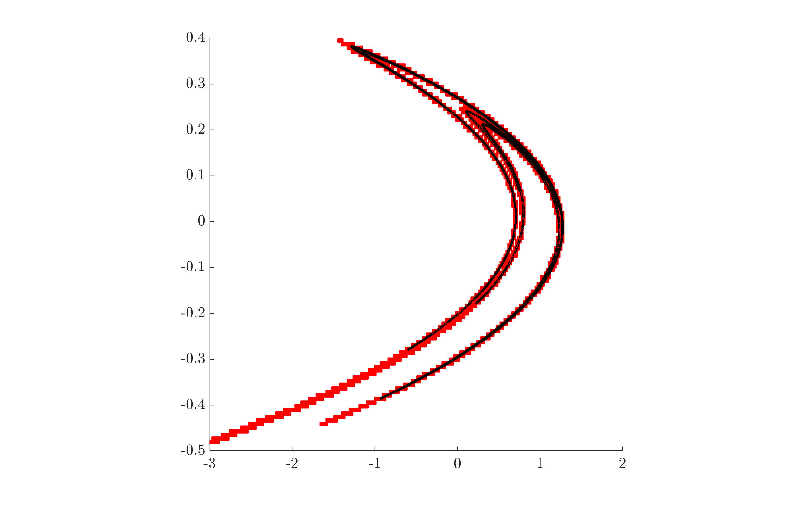

### Relative global attractor of the Hénon map

We start by defining the Hénon map
```matlab
a = 1.3; b = 0.2;                                       
f = @(x) [1-a*x(:,1).^2+x(:,2)  b*x(:,1)];              
```
A simple simulation will show the global attractor
```matlab
n = 10000;
x = zeros(n,2);                                        
for k = 1:n, 
    x(k+1,:) = f(x(k,:));
end               
scatter(x(10:end,1),x(10:end,2),2,'k'); 
```


In order to begin the GAIO computation we initialize the tree data structure
```matlab
center = [0 0]; 
radius = [3 3];                         
t = Tree(center, radius);
``` 
define a 10 by 10 grid of sample points in the reference square [-1,1] x [-1,1]
```matlab
n = 10; X1 = linspace(-1,1,n); 
[XX,YY] = meshgrid(X1,X1);
X = [XX(:) YY(:)];
```
and now run the subdivision algorithm from [Dellnitz, Hohmann, 1997]
```matlab
dim = t.dim;                                    % dimension of state space
depth = 18;                                     % final depth of the tree
hit = 1; sd = 8;                                % define flags
for i = 1:depth                                 % subdivide up to final depth
    t.set_flags('all', sd);                     % flag all boxes for subdivision
    t.subdivide(sd);                            % subdivide all flaged boxes
    b = t.first_box(i);                         % loop over leaves of the tree
    while (~isempty(b))
        c = b(1:dim);                           % center of current box
        r = b(dim+1:2*dim);                     % radius of current box
        p = X*diag(r) + ones(size(X))*diag(c);  % construct sample points in current box
        fp = f(p);                              % map points
        t.set_flags(fp', hit);                  % flag boxes which are hit by the image points
        b = t.next_box(i);                      % move to next box
    end
    t.remove(hit);                              % remove all boxes which have *not* been hit
end
```
We generate a plot of the resulting box collection, and plot the trajectory from the simulation on top.
```matlab
boxplot2(t,'edgecolor','r'); 
hold on
scatter(x(10:end,1),x(10:end,2),10,'k');
```


Note that the relative global attractor computed by GAIO (red) covers the attractor from simulation. In addition, it also covers the saddle fixed point at ~(-1.1,-0.35) and part of its unstable manifold.
